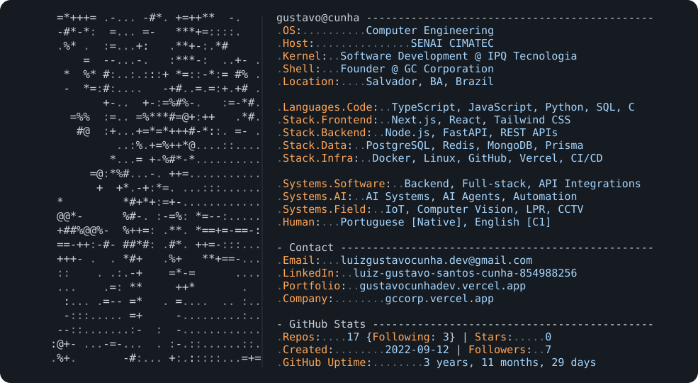

<h1 align="center">Luiz Gustavo Cunha</h1>

  <picture>
    <source media="(prefers-color-scheme: dark)" srcset="./dark_mode.svg">
    <source media="(prefers-color-scheme: light)" srcset="./light_mode.svg">
    
  </picture>

  Computer Engineering @ SENAI CIMATEC | Software Development Intern @ IPQ Tecnologia | Founder @ GC Corporation

  Backend | Full-stack | AI Systems | API Integrations | IoT | Computer Vision | DevOps

  <a href="mailto:luizgustavocunha.dev@gmail.com">Email</a> |
  <a href="https://www.linkedin.com/in/luiz-gustavo-santos-cunha-854988256/">LinkedIn</a> |
  <a href="https://gustavocunhadev.vercel.app/">Portfolio</a> |
  <a href="https://gccorp.vercel.app/">GC Corporation</a>

